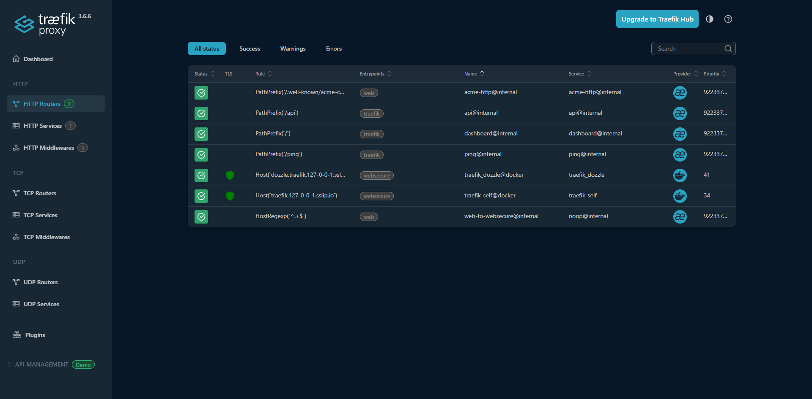
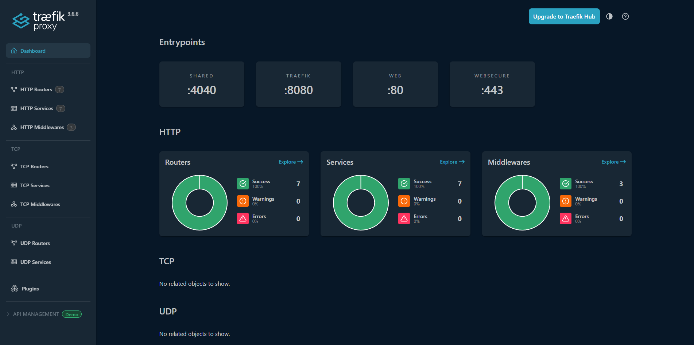
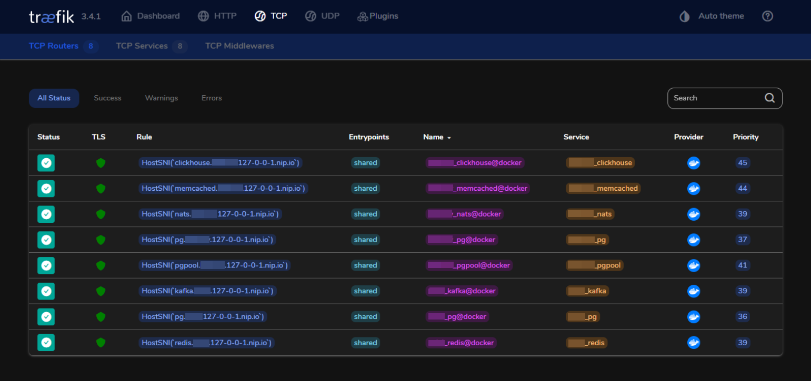
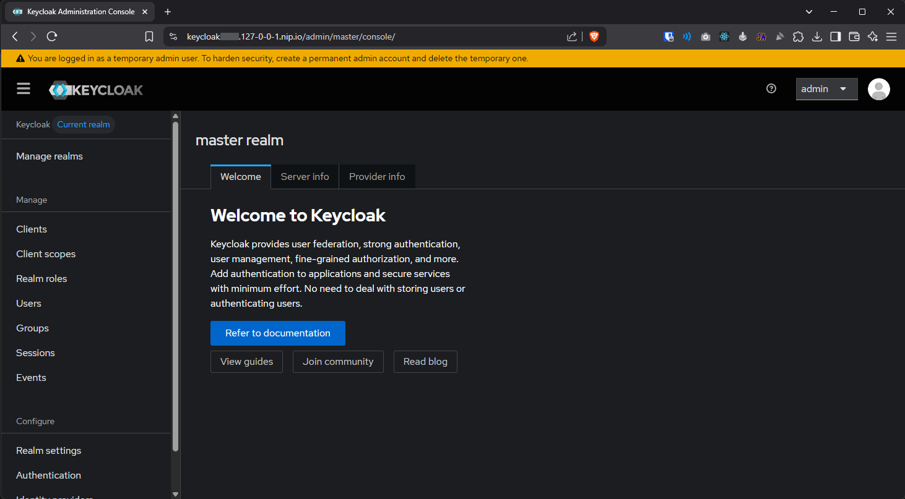
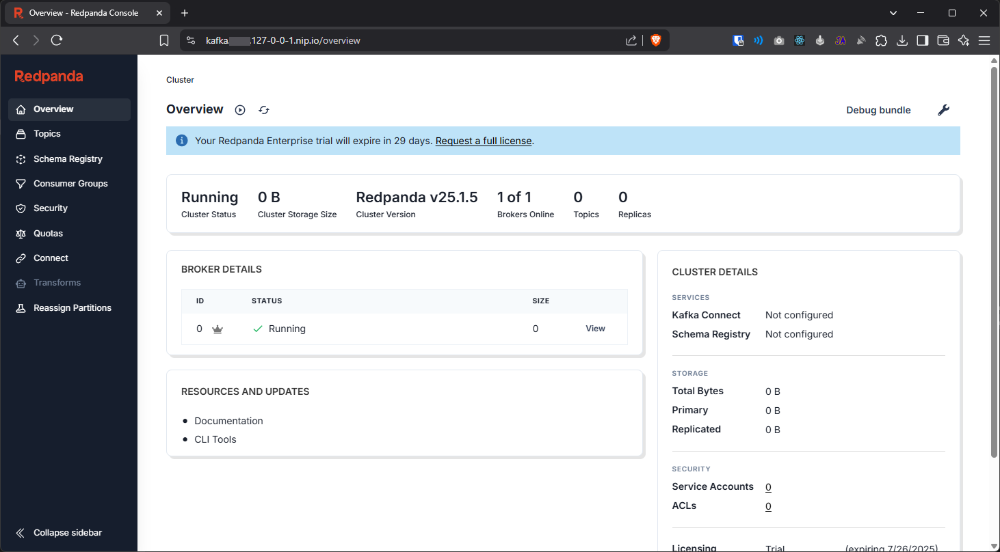
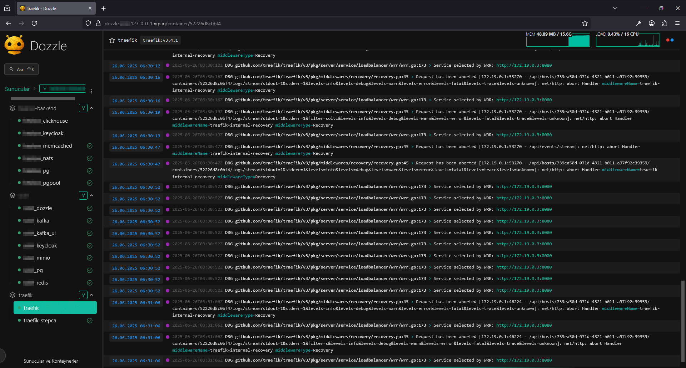

# Shared local ingress, TLS, and tailnet DNS

This repository provides reusable development ingress for multiple projects:

- [Traefik](https://traefik.io/) reverse proxying on the shared
  `traefik_proxy` Docker network
- [Smallstep Step CA](https://smallstep.com/docs/step-ca/) certificates issued
  to Traefik through ACME
- a persistent Tailscale subnet router and CoreDNS split DNS for `tail.gg`
- private `tail.gg` service names routed through the shared Traefik ingress
- optional, self-contained service recipes

Projects keep ownership of their application containers and Traefik labels.
This stack owns the cross-project edge, certificate authority, DNS server, and
Tailscale connector.



## 🔧 Project Structure

- `docker-compose.yaml`: master Compose model and stable shared networks
- `compose/edge/`: Step CA and Traefik
- `compose/tailscale/`: Tailscale connector, CoreDNS, and its operator guide
- `compose/observability/`: shared operational tooling such as Dozzle
- `traefik/traefik-static.yaml`: Static Traefik configuration with ACME resolver
- `taskfile.yaml`: CLI automation with [`task`](https://taskfile.dev)
- `certs/`: Extracted TLS certificates, including the root CA
- `recipes/`: optional examples that are not included in the central stack

> [!NOTE]  
> Step CA uses `network_mode: host` so ACME challenges follow the host's
> Tailscale split DNS and advertised Docker routes. Traefik connects to the CA
> via `host.docker.internal` for certificate requests.

---

## 🚀 Quick Start

### 1. Clone the Repository

First, clone this repository to a local directory where you'll be running your
development environment:

```sh
git clone https://github.com/teyfix/traefik
cd traefik
```

Make sure you're inside the cloned folder before running any of the next steps.

### 2. Configure Tailscale

Set the non-secret shared network values in `.env`. The intended defaults are:

```env
TAIL_DOMAIN=tail.gg
DIRECT_DOMAIN=dkr.tail.gg
TS_SERVICE_SUBNET=10.10.10.0/24
TS_DNS_SERVER=10.10.10.10
TS_ROUTES=10.10.10.0/24,172.16.0.0/12
```

Complete the one-time tailnet policy, route-approval, DNS, and auth-key setup in
[`compose/tailscale/README.md`](compose/tailscale/README.md). Put `TS_AUTHKEY`
only in the documented gitignored local environment file; never commit it.

### 3. Render and start the base environment

```bash
docker compose config
task up
```

This will:

- Start Step CA, Traefik, and observability services
- Wait until Step CA is healthy
- Allow Traefik to request certificates using ACME
- Create stable external networks for application projects

Tailscale and CoreDNS are deliberately behind the `tailscale` profile. After
the tailnet administration and local auth-key setup are complete, render and
start the full stack with:

```bash
docker compose --profile tailscale config
task up:full
```

`task up:full` starts or recreates the base dependencies as well as Tailscale
and CoreDNS. The equivalent raw start command is
`docker compose --profile tailscale up -d`.

### 4. Trust the root CA (Linux)

```bash
task certs:install
```

This will:

- Copy `root_ca.crt` from the Step CA container
- Install it to your system trust store via `update-ca-certificates`

✅ Works for WSL, Debian, Ubuntu, etc.

> [!TIP]  
> You can use `/usr/local/share/ca-certificates/traefik-stepca-root-ca.crt` as
> the root certificate for apps that do not use the system trust store.

### 5. Trust the Root CA (Windows)

To make Windows trust the locally issued TLS certificates:

```sh
task certs
explorer.exe certs
```

Then follow these steps to install the certificate:

1. In the opened folder, double-click the file named `root_ca.crt`.
2. A security warning will appear — click **"Open"**.
3. The certificate viewer will open. Click **"Install Certificate..."**.
4. Choose **"Local Machine"** (this requires administrator privileges), then
   click **Next**.
5. Select **"Place all certificates in the following store"**, then click
   **Browse**.
6. Choose **"Trusted Root Certification Authorities"**, then click **OK**.
7. Click **Next**, then **Finish**.
8. A final prompt will confirm the installation — click **Yes**.

> 🛡️ You should now be able to visit services like
> `https://traefik.tail.gg` in your browser without any certificate
> warnings.

### 6. Attach an application project

For the normal HTTPS path, attach a service to `traefik_proxy` and keep its
project-owned Traefik labels. A host such as `api.ukiyo.tail.gg` resolves to
Traefik, which then selects the project router.

Direct container access is opt-in and uses an exact alias such as
`hello.ukiyo.dkr.tail.gg` on the external `tailscale_services` network. It
bypasses Traefik security and TLS. See the
[`tailscale-direct` recipe](recipes/tailscale-direct/README.md) before using
that path.

## 🧪 Example: Secure PostgreSQL behind Traefik

You can run services like PostgreSQL behind Traefik using TCP with TLS
termination:

```yaml
networks:
  traefik_proxy:
    name: traefik_proxy
    external: true

services:
  postgres:
    image: teyfix/timescaledb-pgrx:latest
    labels:
      - "traefik.enable=true"
      - "traefik.tcp.routers.teyfix_pg.rule=HostSNI(`pg.teyfix.tail.gg`)"
      - "traefik.tcp.routers.teyfix_pg.entrypoints=shared"
      - "traefik.tcp.routers.teyfix_pg.service=teyfix_pg"
      - "traefik.tcp.routers.teyfix_pg.tls=true"
      - "traefik.tcp.routers.teyfix_pg.tls.certresolver=stepca"
      - "traefik.tcp.services.teyfix_pg.loadbalancer.server.port=5432"
    networks:
      - traefik_proxy
```

You can now securely connect to PostgreSQL at
`pg.teyfix.tail.gg:4040` with TLS.

> [!NOTE]  
> Port `4040` corresponds to the `shared` TCP entrypoint defined in Traefik's
> configuration, which is designed for non-HTTP services like databases.

## 🌐 Example: HTTP Service (MinIO) Behind Traefik

You can also expose standard HTTP services like **MinIO** behind Traefik with
HTTPS:

```yaml
networks:
  traefik_proxy:
    name: traefik_proxy
    external: true

services:
  minio:
    image: minio/minio:latest
    environment:
      # Prevents redirecting to the console when accessing the API directly
      - MINIO_BROWSER_REDIRECT=false
    expose:
      - 9000 # API
      - 9001 # Console
    networks:
      - traefik_proxy
    labels:
      - "traefik.enable=true"

      # MinIO API
      - "traefik.http.routers.teyfix_minio_api.rule=Host(`minio-api.teyfix.tail.gg`)"
      - "traefik.http.routers.teyfix_minio_api.tls=true"
      - "traefik.http.routers.teyfix_minio_api.entrypoints=websecure"
      - "traefik.http.routers.teyfix_minio_api.tls.certresolver=stepca"
      - "traefik.http.routers.teyfix_minio_api.service=teyfix_minio_api"
      - "traefik.http.services.teyfix_minio_api.loadbalancer.server.port=9000"

      # MinIO Console
      - "traefik.http.routers.teyfix_minio_console.rule=Host(`minio-console.teyfix.tail.gg`)"
      - "traefik.http.routers.teyfix_minio_console.tls=true"
      - "traefik.http.routers.teyfix_minio_console.entrypoints=websecure"
      - "traefik.http.routers.teyfix_minio_console.tls.certresolver=stepca"
      - "traefik.http.routers.teyfix_minio_console.service=teyfix_minio_console"
      - "traefik.http.services.teyfix_minio_console.loadbalancer.server.port=9001"
```

✅ Once running, you can securely access:

- `https://minio-api.teyfix.tail.gg` for the API
- `https://minio-console.teyfix.tail.gg` for the web console

---

## 🛠 Available Tasks

| Task                 | Description                                                   |
| -------------------- | ------------------------------------------------------------- |
| `task up`            | Start/recreate base services without stopping Tailscale       |
| `task up:full`       | Start/recreate base, Tailscale, and CoreDNS services          |
| `task down`          | Stop both profiles while preserving persistent state          |
| `task recreate`      | Recreate base services without stopping Tailscale             |
| `task recreate:full` | Stop and recreate both profiles                               |
| `task logs`          | Follow logs of all containers                                 |
| `task certs`         | Export certificates from Step CA                              |
| `task certs:install` | Install the root CA into your Linux trust store               |
| `task purge`         | Stop both profiles and remove CA, ACME, and Tailscale state    |

---

## 🌐 Traefik Dashboard

Once up, you can access the Traefik dashboard via either:

- **HTTPS (recommended)**: `https://traefik.tail.gg`
- **HTTP (insecure)**: `http://localhost:8080`

> [!TIP]  
> The HTTPS version uses certificates issued by your local Step CA, while the
> HTTP version runs in insecure mode for development convenience.

---

## 🔐 Step CA Access

If you need direct access to Step CA for advanced certificate management:

```sh
https://localhost:9000
```

> [!NOTE]  
> Direct Step CA access is typically not needed for normal development
> workflows, as Traefik handles certificate requests automatically via ACME.

---

## 📄 TLS Certificate Details

- Root CA is generated by Step CA and used by Traefik's ACME resolver
- Certificates are stored under `/home/step/certs/` in the `stepca` container
- Traefik mounts these and uses them via `certResolver: stepca`

---

## 🌐 Network Architecture

This stack exposes application services through two distinct paths:

- Ordinary names such as `api.ukiyo.tail.gg` resolve through CoreDNS at
  `10.10.10.10` to Traefik's Docker address. The project service only needs the
  `traefik_proxy` network and its own labels.
- Names under `dkr.tail.gg`, such as `hello.ukiyo.dkr.tail.gg`, resolve through
  Docker embedded DNS to the exact alias of a container explicitly joined to
  `tailscale_services`.

Tailscale routes the returned IP, not the hostname. CoreDNS selects the
destination address class. The subnet router advertises `10.10.10.0/24` for
CoreDNS/direct containers and `172.16.0.0/12` for Docker/Traefik.

Traefik publishes ports `80`, `443`, `8080`, and `4040` only on
`127.0.0.1`. Host-local clients can still use those published ports, while
ordinary LAN clients cannot reach them through a host interface. Tailnet
clients instead reach Traefik's Docker address through the approved
`172.16.0.0/12` subnet route. This boundary depends on restrictive Tailscale
grants: private `tail.gg` DNS names are service discovery, not authorization.

Certificate validation additionally uses this configuration:

- **Step CA** runs in `network_mode: host` to use the host's tailnet split DNS
  and advertised routes during ACME challenges
- **Traefik** connects to Step CA via `host.docker.internal:9000` for
  certificate requests
- **Services** run on the `traefik_proxy` bridge network for proper service
  discovery

> [!IMPORTANT]  
> Step CA must use host networking so ACME validation follows the same tailnet
> DNS and routed Docker path as clients.

The complete tailnet policy, split-DNS, route, ownership, direct-container, and
migration contract is documented in
[`compose/tailscale/README.md`](compose/tailscale/README.md).

---

## 🛡 Security Notes

- This setup is for local/dev use only
- Certificates are **not publicly trusted**
- Browsers may still show a warning unless root CA is manually trusted
- Host-published Traefik ports are loopback-only; tailnet access uses the
  routed Docker address and must be restricted with Tailscale grants
- Private `tail.gg` DNS records do not authorize access or replace application
  authentication for sensitive services
- Direct `*.dkr.tail.gg` exposure bypasses Traefik TLS, middleware, and auth
- `172.16.0.0/12` routing can overlap client LAN, VPN, or Docker networks
- Tailnet split DNS for `tail.gg` shadows public records under the same suffix

Using an owned suffix provides stable OAuth callback names, but providers such
as Google still require the configured domain, HTTPS rules, and redirect URI to
match exactly. Some providers require public reachability or a publicly trusted
certificate; trusting the private Step CA locally does not satisfy those checks.

---

## 🧼 Cleanup

```bash
task down
```

This stops the stack and removes orphan containers while preserving persistent
Step CA, ACME, and Tailscale state. To deliberately delete that state, use
`task purge` and confirm the destructive prompt.

---

## 📦 Requirements

- [Docker](https://www.docker.com/)
- Docker Compose with support for top-level `include`
- [Task](https://taskfile.dev)
- Linux or WSL (for root CA trust automation)

## Screenshots

### Traefik

#### Dashboard



#### HTTP Routers


#### TCP Routers

> [!WARNING]  
> This image is outdated and will be updated in the future.



### Services

#### KeyCloak Dashboard



#### RedPanda Console



#### Dozzle


