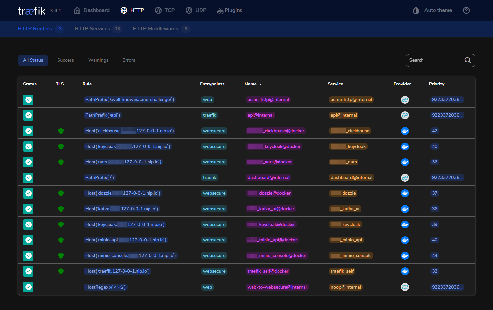

# 🛡️ Local Dev with Traefik + Step CA + ACME TLS

This project sets up a local HTTPS environment using:

- [Traefik](https://traefik.io/) as a reverse proxy
- [Smallstep Step CA](https://smallstep.com/docs/step-ca/) for issuing local TLS certificates via ACME
- Automatic trust installation for `root_ca.crt`
- Taskfile automation (`task`) for convenience
- Zero DNS configuration thanks to [sslip.io](https://sslip.io/)
  - This allows you to access services like `https://traefik.127-0-0-1.nip.io` without any DNS configuration.



## Table of Contents

- [🛡️ Local Dev with Traefik + Step CA + ACME TLS](#️-local-dev-with-traefik--step-ca--acme-tls)
  - [Table of Contents](#table-of-contents)
  - [🔧 Project Structure](#-project-structure)
  - [🚀 Quick Start](#-quick-start)
    - [1. Clone the Repository](#1-clone-the-repository)
    - [2. Start the environment](#2-start-the-environment)
    - [3. Trust the root CA (Linux)](#3-trust-the-root-ca-linux)
    - [4. Trust the Root CA (Windows)](#4-trust-the-root-ca-windows)
  - [🧪 Example: Secure PostgreSQL behind Traefik](#-example-secure-postgresql-behind-traefik)
  - [🌐 Example: HTTP Service (MinIO) Behind Traefik](#-example-http-service-minio-behind-traefik)
  - [🛠 Available Tasks](#-available-tasks)
  - [🌐 Traefik Dashboard](#-traefik-dashboard)
  - [🔐 Step CA Access](#-step-ca-access)
  - [📄 TLS Certificate Details](#-tls-certificate-details)
  - [🌐 Network Architecture](#-network-architecture)
  - [🛡 Security Notes](#-security-notes)
  - [🧼 Cleanup](#-cleanup)
  - [📦 Requirements](#-requirements)
  - [Screenshots](#screenshots)
    - [Traefik HTTP Routers](#traefik-http-routers)
    - [Traefik TCP Routers](#traefik-tcp-routers)
    - [Services](#services)
      - [KeyCloak Dashboard](#keycloak-dashboard)
      - [RedPanda Console](#redpanda-console)
      - [Dozzle](#dozzle)

## 🔧 Project Structure

- `docker-compose.yaml`: Orchestrates Traefik and Step CA
- `traefik/traefik-static.yaml`: Static Traefik configuration with ACME resolver
- `taskfile.yaml`: CLI automation with [`task`](https://taskfile.dev)
- `certs/`: Extracted TLS certificates, including the root CA

```markdown
> [!NOTE]
> Step CA uses `network_mode: host` to resolve `127.0.0.1` domains during ACME challenges, while Traefik connects via `host.docker.internal` for certificate requests.
```

---

## 🚀 Quick Start

### 1. Clone the Repository

First, clone this repository to a local directory where you'll be running your development environment:

```sh
git clone https://github.com/teyfix/traefik
cd traefik
```

Make sure you're inside the cloned folder before running any of the next steps.

### 2. Start the environment

```bash
task up
```

This will:

- Start Step CA and Traefik
- Wait until Step CA is healthy
- Traefik will generate and request certs using ACME

### 3. Trust the root CA (Linux)

```bash
task certs:install
```

This will:

- Copy `root_ca.crt` from the Step CA container
- Install it to your system trust store via `update-ca-certificates`

> ✅ Works for WSL, Debian, Ubuntu, etc.

### 4. Trust the Root CA (Windows)

To make Windows trust the locally issued TLS certificates:

```sh
task certs
explorer.exe certs
```

Then follow these steps to install the certificate:

1. In the opened folder, double-click the file named `root_ca.crt`.
2. A security warning will appear — click **"Open"**.
3. The certificate viewer will open. Click **"Install Certificate..."**.
4. Choose **"Local Machine"** (this requires administrator privileges), then click **Next**.
5. Select **"Place all certificates in the following store"**, then click **Browse**.
6. Choose **"Trusted Root Certification Authorities"**, then click **OK**.
7. Click **Next**, then **Finish**.
8. A final prompt will confirm the installation — click **Yes**.

> 🛡️ You should now be able to visit services like `https://traefik.127-0-0-1.nip.io` in your browser without any certificate warnings.

## 🧪 Example: Secure PostgreSQL behind Traefik

You can run services like PostgreSQL behind Traefik using TCP with TLS termination:

> [!WARNING]
> If the service you expose through Traefik is attached to multiple Docker networks, Traefik may randomly fail to connect to it. To avoid this, try limiting the service to only the network Traefik uses (e.g., traefik_proxy).

```yaml
networks:
  traefik_proxy:
    name: traefik_proxy
    external: true

services:
  postgres:
    image: teyfix/timescaledb-pgrx:latest
    labels:
      - "traefik.enable=true"
      - "traefik.tcp.routers.teyfix_pg.rule=HostSNI(`pg.teyfix.127-0-0-1.nip.io`)"
      - "traefik.tcp.routers.teyfix_pg.entrypoints=shared"
      - "traefik.tcp.routers.teyfix_pg.service=teyfix_pg"
      - "traefik.tcp.routers.teyfix_pg.tls=true"
      - "traefik.tcp.routers.teyfix_pg.tls.certresolver=stepca"
      - "traefik.tcp.services.teyfix_pg.loadbalancer.server.port=5432"
    networks:
      - traefik_proxy
```

You can now securely connect to PostgreSQL at `pg.teyfix.127-0-0-1.nip.io:4040` with TLS.

> [!NOTE]
> Port `4040` corresponds to the `shared` TCP entrypoint defined in Traefik's configuration, which is designed for non-HTTP services like databases.

> [!TIP]
> `nip.io` is used here for convenience — it’s a wildcard DNS service similar to `sslip.io`. The main difference is that `nip.io` uses a shorter TLD.

## 🌐 Example: HTTP Service (MinIO) Behind Traefik

You can also expose standard HTTP services like **MinIO** behind Traefik with HTTPS:

```yaml
networks:
  traefik_proxy:
    name: traefik_proxy
    external: true

services:
  minio:
    image: minio/minio:latest
    environment:
      # Prevents redirecting to the console when accessing the API directly
      - MINIO_BROWSER_REDIRECT=false 
    expose:
      - 9000 # API
      - 9001 # Console
    networks:
      - traefik_proxy
    labels:
      - "traefik.enable=true"

      # MinIO API
      - "traefik.http.routers.teyfix_minio_api.rule=Host(`minio-api.teyfix.127-0-0-1.nip.io`)"
      - "traefik.http.routers.teyfix_minio_api.tls=true"
      - "traefik.http.routers.teyfix_minio_api.entrypoints=websecure"
      - "traefik.http.routers.teyfix_minio_api.tls.certresolver=stepca"
      - "traefik.http.routers.teyfix_minio_api.service=teyfix_minio_api"
      - "traefik.http.services.teyfix_minio_api.loadbalancer.server.port=9000"

      # MinIO Console
      - "traefik.http.routers.teyfix_minio_console.rule=Host(`minio-console.teyfix.127-0-0-1.nip.io`)"
      - "traefik.http.routers.teyfix_minio_console.tls=true"
      - "traefik.http.routers.teyfix_minio_console.entrypoints=websecure"
      - "traefik.http.routers.teyfix_minio_console.tls.certresolver=stepca"
      - "traefik.http.routers.teyfix_minio_console.service=teyfix_minio_console"
      - "traefik.http.services.teyfix_minio_console.loadbalancer.server.port=9001"
```

✅ Once running, you can securely access:

- `https://minio-api.teyfix.127-0-0-1.nip.io` for the API
- `https://minio-console.teyfix.127-0-0-1.nip.io` for the web console

---

## 🛠 Available Tasks

| Task                 | Description                                     |
| -------------------- | ----------------------------------------------- |
| `task up`            | Start containers with fresh state               |
| `task down`          | Stop and remove containers, volumes, orphans    |
| `task recreate`      | Fully restart the stack                         |
| `task logs`          | Follow logs of all containers                   |
| `task certs`         | Export certs from the Step CA container         |
| `task certs:install` | Install the root CA into your Linux trust store |

---

## 🌐 Traefik Dashboard

Once up, you can access the Traefik dashboard via either:

- **HTTPS (recommended)**: `https://traefik.127-0-0-1.nip.io`
- **HTTP (insecure)**: `http://localhost:8080`

> [!TIP]
> The HTTPS version uses certificates issued by your local Step CA, while the HTTP version runs in insecure mode for development convenience.

---

## 🔐 Step CA Access

If you need direct access to Step CA for advanced certificate management:

```sh
https://localhost:9000
```

> [!NOTE]
> Direct Step CA access is typically not needed for normal development workflows, as Traefik handles certificate requests automatically via ACME.

---

## 📄 TLS Certificate Details

- Root CA is generated by Step CA and used by Traefik's ACME resolver
- Certificates are stored under `/home/step/certs/` in the `stepca` container
- Traefik mounts these and uses them via `certResolver: stepca`

---

## 🌐 Network Architecture

This setup uses a specific networking configuration to handle certificate validation:

- **Step CA** runs in `network_mode: host` to properly resolve `127.0.0.1` domains during ACME challenges
- **Traefik** connects to Step CA via `host.docker.internal:9000` for certificate requests
- **Services** run on the `traefik_proxy` bridge network for proper service discovery

> [!IMPORTANT]
> Step CA cannot access Traefik services for ACME validation when both are on Docker bridge networks due to `127.0.0.1` resolution limitations. The host networking mode for Step CA resolves this issue.

---

## 🛡 Security Notes

- This setup is for local/dev use only
- Certificates are **not publicly trusted**
- Browsers may still show a warning unless root CA is manually trusted

---

## 🧼 Cleanup

```bash
task down
```

This will stop and remove everything, including volumes and orphan containers.

---

## 📦 Requirements

- [Docker](https://www.docker.com/)
- [Task](https://taskfile.dev)
- Linux or WSL (for root CA trust automation)

## Screenshots

### Traefik HTTP Routers


### Traefik TCP Routers


### Services

#### KeyCloak Dashboard


#### RedPanda Console


#### Dozzle


